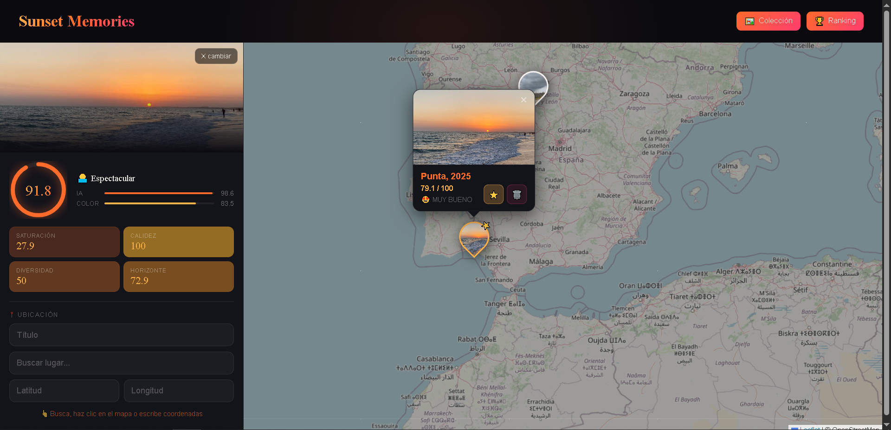
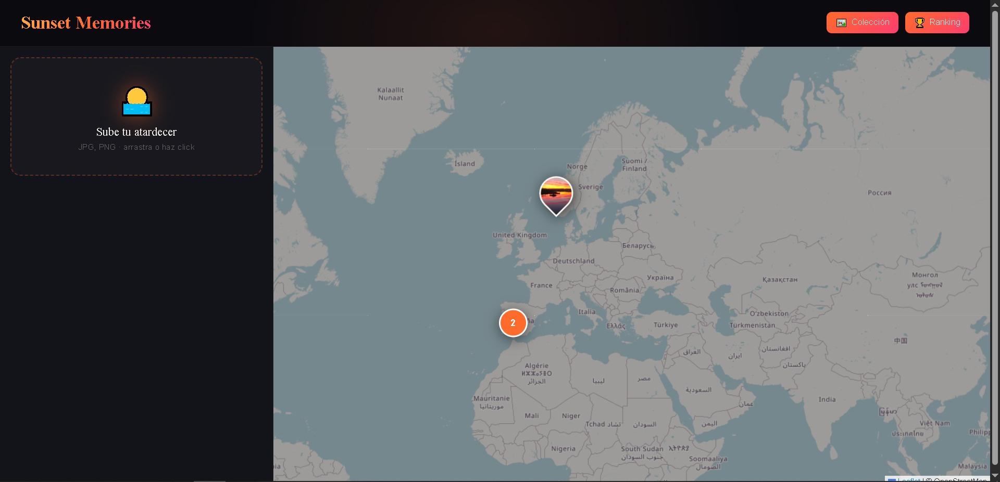
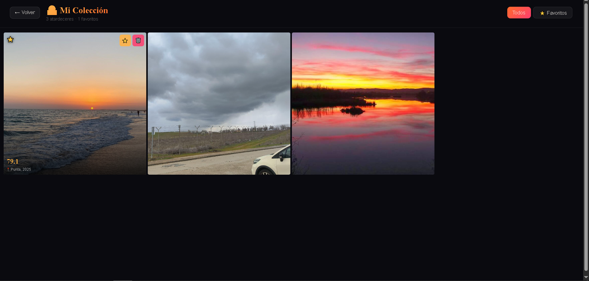
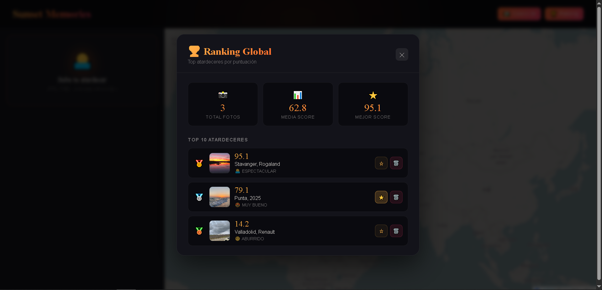

# 🌅 SkyPalette — Sunset Memories

Me encantan los atardeceres y tengía cientos de fotos sin ningún orden. Un día se me ocurrió que estaría bien tener un sitio donde coleccionarlas todas y verlas en un mapa según dónde las hice. Además pensé en tener un "juez" que me dijera cuáles son objetivamente las mejores. Para ello, decidí entrenar un modelo de IA para que diferencie fotos de atardeceres de todo lo que no lo sea y analizar los colores del cielo.

**Analiza, puntúa y mapea fotografías de atardeceres con Inteligencia Artificial.**

Subes una foto → la IA la analiza → obtienes una puntuación → la guardas con ubicación → aparece en el mapa.
 
**El análisis tiene dos partes:**
 
- **Modelo IA** — ResNet18 entrenado con Transfer Learning. Lo entrené durante 20 épocas en una T4 y llegó a 94.4% de accuracy. Clasifica el atardecer en: ESPECTACULAR / MUY BUENO / ACEPTABLE / ABURRIDO.
 
- **Análisis de color** — Evalúa solo la franja del horizonte (la parte que importa de verdad). Mira saturación, calidez, diversidad cromática e intensidad. Da un bonus si hay buen contraste entre tonos cálidos y fríos, que es lo que hace que un atardecer sea realmente fotogénico.

---

## ✨ Funcionalidades

- 📸 **Análisis por IA** — Modelo ResNet18 con Transfer Learning (94.4% accuracy) que clasifica la calidad del atardecer
- 🎨 **Análisis de color inteligente** — Evalúa la zona del horizonte por separado: saturación, calidez, diversidad cromática, intensidad y contraste cálido-frío
- 🗺️ **Mapa global** — Visualización con marcadores fotográficos y clustering
- ⭐ **Favoritos** — Marca tus mejores capturas
- 🏆 **Ranking** — Top 10 con estadísticas globales
- 🖼️ **Colección** — Galería fotográfica con filtro por favoritos
- 📍 **Buscador de ubicación** — Integración con Nominatim (OpenStreetMap)
- 📱 **Diseño responsive** — Interfaz adaptada a móvil con navegación por tabs

---

## 🛠️ Stack Tecnológico

| Capa | Tecnología |
|------|-----------|
| Frontend | React + Leaflet + react-leaflet-cluster |
| Backend | Python + FastAPI + SQLAlchemy |
| IA | PyTorch + ResNet18 (Transfer Learning) |
| Base de datos | PostgreSQL + PostGIS |
| Infraestructura | Docker |

---

## 📁 Estructura del proyecto

```
skypalette/
├── backend/
│   ├── app/
│   │   ├── main.py                         # endpoints de la API
│   │   ├── database.py                     # conexión a PostgreSQL
│   │   ├── models.py                       # modelos de la BD
│   │   ├── schemas.py                      # schemas de validación
│   │   └── ml/
│   │       ├── model.py                    # carga el modelo PyTorch
│   │       ├── color_analyzer.py           # análisis de la paleta de colores
│   │       ├── exif_extractor.py           # extrae GPS del EXIF
│   │       └── skypalette_model_best.pth   # pesos del modelo entrenado
│   └── requirements.txt
├── frontend/
│   └── src/
│       ├── App.jsx
│       ├── api.js
│       ├── index.css
│       └── components/
│           ├── Sidebar.jsx          # panel de subida y análisis
│           ├── MapView.jsx          # mapa con marcadores y clusters
│           ├── CollectionPanel.jsx  # galería de fotos
│           ├── RankingModal.jsx     # top 10 y estadísticas
│           └── Lightbox.jsx         # visor a pantalla completa
├── docker-compose.yml
└── README.md
```

---

## 🚀 Instalación y uso

### Requisitos previos

- [Docker](https://www.docker.com/) y Docker Compose
- [Node.js](https://nodejs.org/) 18+
- Python 3.10+

### 1. Clonar el repositorio

```bash
git clone https://github.com/tu-usuario/sunset_memories.git
cd sunset_memories
```

### 2. Arrancar la base de datos

```bash
docker-compose up -d
```

Esto levanta un contenedor PostgreSQL + PostGIS en el puerto `5432`.

### 3. Backend

```bash
cd backend
python -m venv venv
.\venv\Scripts\activate      # Windows
# source venv/bin/activate   # macOS/Linux

pip install -r requirements.txt

uvicorn app.main:app --reload
```

El backend estará disponible en `http://127.0.0.1:8000`.

### 4. Frontend

```bash
cd frontend
npm install
npm run dev
```

La app estará disponible en `http://localhost:5173`.

---

## 🔌 API Endpoints

| Método | Ruta | Qué hace |
|--------|------|----------|
| `POST` | `/analyze` | Analiza la imagen, devuelve score + GPS si tiene |
| `POST` | `/save` | Guarda el atardecer en la BD |
| `GET` | `/sunsets` | Devuelve todos los atardeceres |
| `PATCH` | `/sunsets/{id}/favorite` | Marca/desmarca como favorito |
| `DELETE` | `/sunsets/{id}` | Elimina un atardecer |

---

## 🧠 Modelo de IA

El modelo está basado en **ResNet18** con Transfer Learning:

- **Dataset**: imágenes de atardeceres clasificadas manualmente
- **Entrenamiento**: 20 épocas en GPU T4
- **Mejor validación**: 94.4% accuracy (época 15)
- **Score final**: `(Score IA × 0.65) + (Score Color × 0.35)`

### Criterios del análisis de color

El analizador evalúa exclusivamente la **franja del horizonte** (25%–70% de altura de la imagen), evitando que el cielo gris o el suelo penalicen el resultado:

| Criterio | Peso | Descripción |
|----------|------|-------------|
| Saturación | 20% | Intensidad del color en píxeles cálidos |
| Calidez | 35% | Cobertura de tonos naranja/rojo/dorado ponderada por brillo |
| Diversidad | 20% | Variedad cromática en el horizonte |
| Horizonte | 25% | Intensidad visual de la franja clave |
| Bonus contraste | +10 | Premio por convivencia de cálidos + fríos (naranja + azul) |

---

## 🐳 Docker Compose

```yaml
services:
  db:
    image: postgis/postgis:15-3.3
    container_name: skypalette_db
    environment:
      POSTGRES_USER: admin
      POSTGRES_PASSWORD: superpassword
      POSTGRES_DB: skypalette
    ports:
      - "5432:5432"
```

---

## 📱 Capturas de pantalla





